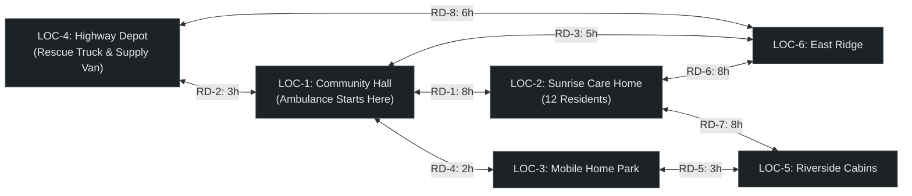

```mermaid
flowchart LR
    %% Styling to mimic the reference architecture plates
    classDef default fill:#1c2226,stroke:#2d373c,stroke-width:1px,color:#e4e8e6
    
    %% Nodes
    L4["LOC-4: Highway Depot<br/>(Rescue Truck & Supply Van)"]
    L1["LOC-1: Community Hall<br/>(Ambulance Starts Here)"]
    L2["LOC-2: Sunrise Care Home<br/>(12 Residents)"]
    L3["LOC-3: Mobile Home Park"]
    L6["LOC-6: East Ridge"]
    L5["LOC-5: Riverside Cabins"]

    %% Connections routed outside-in to prevent overlap
    L4 <-->|"RD-8: 6h"| L6
    L4 <-->|"RD-2: 3h"| L1
    L1 <-->|"RD-3: 5h"| L6
    L1 <-->|"RD-1: 8h"| L2
    L1 <-->|"RD-4: 2h"| L3
    L2 <-->|"RD-6: 8h"| L6
    L2 <-->|"RD-7: 8h"| L5
    L3 <-->|"RD-5: 3h"| L5
```
