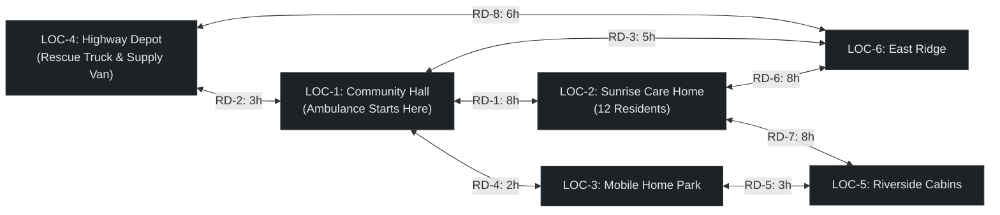
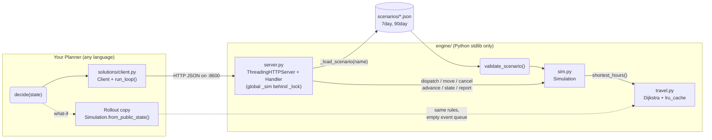

```mermaid
flowchart LR
    %% Styling to mimic the reference architecture plates
    classDef default fill:#1c2226,stroke:#2d373c,stroke-width:1px,color:#e4e8e6
    
    %% Nodes
    L4["LOC-4: Highway Depot<br/>(Rescue Truck & Supply Van)"]
    L1["LOC-1: Community Hall<br/>(Ambulance Starts Here)"]
    L2["LOC-2: Sunrise Care Home<br/>(12 Residents)"]
    L3["LOC-3: Mobile Home Park"]
    L6["LOC-6: East Ridge"]
    L5["LOC-5: Riverside Cabins"]

    %% Connections routed outside-in to prevent overlap
    L4 <-->|"RD-8: 6h"| L6
    L4 <-->|"RD-2: 3h"| L1
    L1 <-->|"RD-3: 5h"| L6
    L1 <-->|"RD-1: 8h"| L2
    L1 <-->|"RD-4: 2h"| L3
    L2 <-->|"RD-6: 8h"| L6
    L2 <-->|"RD-7: 8h"| L5
    L3 <-->|"RD-5: 3h"| L5
```

```mermaid
flowchart LR
    subgraph PL["Your Planner (any language)"]
        D("decide(state)")
        C["solutions/client.py<br/>Client + run_loop()"]
        R["Rollout copy<br/>Simulation.from_public_state()"]
    end

    subgraph EN["engine/ (Python stdlib only)"]
        S["server.py<br/>ThreadingHTTPServer + Handler<br/>(global _sim behind _lock)"]
        SIM["sim.py<br/>Simulation"]
        V("validate_scenario()")
        T["travel.py<br/>Dijkstra + lru_cache"]
    end

    F[("scenarios/*.json<br/>7day, 90day")]

    D --> C
    C -- "HTTP JSON on :8600" --> S
    S -- "_load_scenario(name)" --> F
    F --> V --> SIM
    S -- "dispatch / move / cancel<br/>advance / state / report" --> SIM
    SIM -- "shortest_hours()" --> T
    D -. "what-if" .-> R
    R -. "same rules,<br/>empty event queue" .-> T
```
